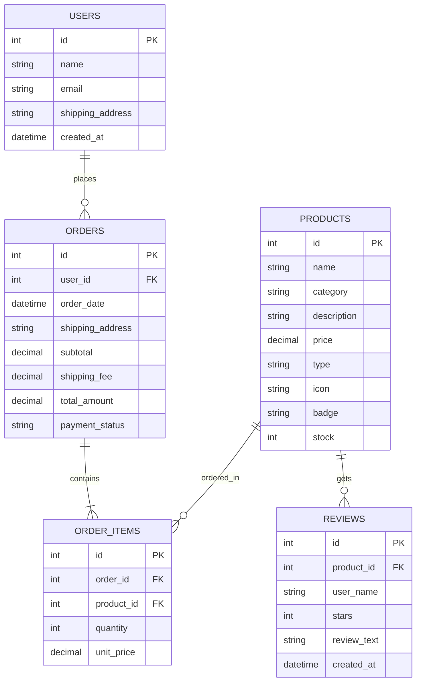

# 📊 Entity Relationship Diagram (ER Diagram) - NEUROVIBE

นี่คือแผนภาพโครงสร้างฐานข้อมูล (ER Diagram) สำหรับระบบร้านค้าออนไลน์ **NEUROVIBE** เพื่อใช้ในการจำลองการเก็บข้อมูลของลูกค้า, ผลิตภัณฑ์, การสั่งซื้อ และการรีวิวครับ

---

## 🗺️ แผนภาพความสัมพันธ์ (Mermaid ER Diagram)

---

## 📝 คำอธิบายรายละเอียด Entity & Attribute

### 1. USERS (ข้อมูลผู้ใช้งาน/ลูกค้า)
* `id` (Primary Key): รหัสสมาชิกผู้ใช้งาน
* `name`: ชื่อ-นามสกุล
* `email`: ที่อยู่อีเมล (ใช้ล็อกอินและใช้สำหรับส่งไฟล์ดาวน์โหลด Digital Planner)
* `shipping_address`: ที่อยู่สำหรับการจัดส่งวิตามินทางไปรษณีย์ (หากไม่ได้ระบุ หรือสั่งเฉพาะ Planner ค่านี้จะเป็น Null)
* `created_at`: วันเวลาที่ลงทะเบียน

### 2. PRODUCTS (ข้อมูลสินค้าในระบบ)
* `id` (Primary Key): รหัสสินค้า
* `name`: ชื่อสินค้า
* `category`: หมวดหมู่สินค้า เช่น `vitamins` หรือ `planners`
* `description`: รายละเอียดคำอธิบายสินค้า
* `price`: ราคาสินค้า
* `type`: รูปแบบการนำจ่ายสินค้า แบ่งเป็น `physical` (สินค้าส่งทางไปรษณีย์) และ `digital` (ส่งไฟล์ดาวน์โหลดทางอีเมล)
* `icon`: สัญลักษณ์ไอคอน (เช่น 🧠, 📅)
* `badge`: ป้ายแท็กติดสินค้า
* `stock`: จำนวนสินค้าคงเหลือ (สำหรับสินค้าแบบ physical)

### 3. ORDERS (ข้อมูลการสั่งซื้อของลูกค้า)
* `id` (Primary Key): รหัสใบสั่งซื้อ
* `user_id` (Foreign Key): เชื่อมไปที่ตาราง `USERS` เพื่อระบุผู้สั่งซื้อ
* `order_date`: วันเวลาที่เกิดการสั่งซื้อ
* `shipping_address`: ที่อยู่จัดส่งจริงในออเดอร์นั้น ๆ
* `subtotal`: ยอดรวมราคาสินค้าทั้งหมดก่อนคำนวณค่าส่ง
* `shipping_fee`: ค่าจัดส่ง (฿50 สำหรับออเดอร์ที่มีวิตามิน, ฿0 สำหรับออเดอร์ดิจิทัล)
* `total_amount`: ยอดชำระสุทธิ (Subtotal + Shipping Fee)
* `payment_status`: สถานะการจ่ายเงิน เช่น `pending` (รอชำระ), `paid` (ชำระแล้ว), หรือ `failed` (ล้มเหลว)

### 4. ORDER_ITEMS (รายการสินค้าแต่ละรายการในใบสั่งซื้อ)
* `id` (Primary Key): รหัสรายการสินค้าในออเดอร์
* `order_id` (Foreign Key): เชื่อมไปที่ตาราง `ORDERS`
* `product_id` (Foreign Key): เชื่อมไปที่ตาราง `PRODUCTS`
* `quantity`: จำนวนชิ้นที่สั่ง
* `unit_price`: ราคาต่อหน่วย ณ ขณะที่กดสั่งซื้อ (ป้องกันกรณีมีการปรับราคาสินค้าภายหลัง)

### 5. REVIEWS (ข้อมูลการรีวิวสินค้า)
* `id` (Primary Key): รหัสการรีวิว
* `product_id` (Foreign Key): เชื่อมไปที่ตาราง `PRODUCTS` เพื่อดูว่ารีวิวสินค้าตัวไหน
* `user_name`: ชื่อผู้ใช้ที่รีวิว
* `stars`: คะแนนดาว (1 - 5)
* `review_text`: ข้อความรีวิวความประทับใจ
* `created_at`: วันเวลาที่รีวิว
